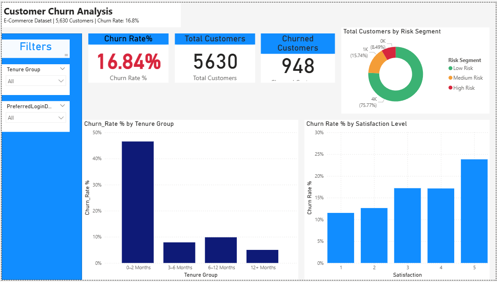

# Customer Churn Analysis Dashboard

## 📊 Project Overview
This project analyzes customer churn behavior for an E-Commerce platform with 5,630 customers.

## 🎯 Objectives
- Identify key churn drivers
- Analyze early-stage customer drop-off
- Segment customers by risk level
- Provide actionable business insights

## 📌 Key Insights
- 47% of churn occurs within first 2 months
- Customers who complain are 3x more likely to churn
- Higher dissatisfaction strongly correlates with churn
- Early-stage retention strategy is critical

## 🛠 Tools Used
- Power BI
- DAX
- Data Cleaning (Excel)
- Business Analysis

## 📈 Dashboard Preview

